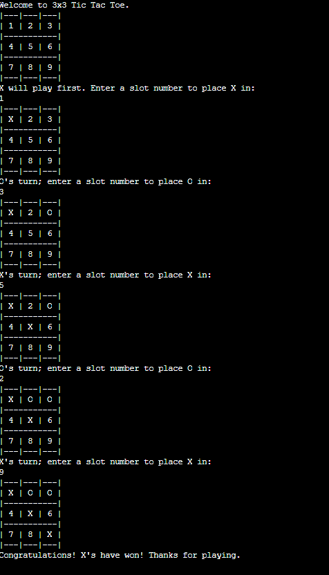

# Tic Tac Toe Game (Java)

## Description
This project is a console based Tic Tac Toe game developed using Java. It demonstrates basic object-oriented programming concepts and game logic where two players
take turns marking spaces on a 3×3 grid until one player wins or the game ends in a draw.

## Features
- Two player gameplay
- Turn based moves
- Win detection
- Simple console interface

## Technologies Used
- Java
- Object-Oriented Programming (OOP)

## Sample Output

## How to Run
1. Compile the program  
   javac tic_tac_toe.java

2. Run the program  
   java tic_tac_toe
